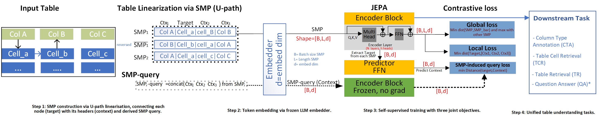

# UTUEL: Unified Table Understanding via context-aware Cell Embedding Learning

UTUEL is a self-supervised framework that turns frozen LLM token embeddings into
context-aware, cell-level table embeddings. It casts Table Representation
Learning as a Joint-Embedding Predictive Architecture (TRL-JEPA): an encoder is
trained over Semantic Meta-Path (U-path) table linearizations under two
objectives, local alignment and global repulsion, while a predictor places any
inference-time query into the learned space without query supervision. Each cell
embedding is conditioned on its row and column context and is computed once per
table, then reused across queries and tasks at no extra per-query cost. A single
5 to 22M-parameter encoder supports Table Question Answering, Table Retrieval,
Table Cell Retrieval, and Column Type Annotation.



## News
- **29-08-2026**: Accepted at IEEE Transaction on Knowledge and Data Engineering (TKDE).
- **08-07-2026**: First release of UTUEL.

UTUEL bundles five related tasks for table understanding research:

1. **Prompt inference pipeline** (`prompts_pipeline/`): batch-run JSONL datasets against local Ollama models.
2. **Table retrieval benchmark** (`table_retrieval/`): rank corpus tables for a natural-language question and report MRR / Hit@k.
3. **Table embedding pretraining** (`TRL-model/`): self-supervised training of `TableEmbedJePA` on U-paths.
4. **Column type annotation, CTA** (`CTA/`): multi-label column type classification, with optional pretrained encoder.
5. **Adhesive table training** (`TRL_Adhesive/`): `TableEmbedJePA` on complex / nested Adhesive tables, where the answer key is a cell id (`answer_cell_id`) rather than a (row, col) coordinate.

Each task is self-contained, driven by a Hydra config, and can be smoke-tested in a few minutes on a small data cap.

---

## Repository layout

```
UTUEL/
├── requirements.txt
├── datasets/                       input JSONL files and generated outputs
├── prompts_pipeline/               Task 1: batch prompt inference (run with -m prompts_pipeline)
├── table_retrieval/                Task 2: table retrieval benchmark (evaluate.py, report.py)
├── TRL-model/                      Task 3: TableEmbedJePA pretraining (train.py, run_train.sh)
├── CTA/                            Task 4: column type annotation (pretrain.py, finetune.py, run_train.sh)
└── TRL_Adhesive/                   Task 5: TableEmbedJePA on Adhesive tables (train.py, run_train.sh)
```

---

## Installation

All commands are run from the repository root.

```bash
# 1. Install dependencies
pip install -r requirements.txt

# 2. Configure environment variables
#    Copy the template and edit the values (e.g. the Ollama server host).
cp .env.example .env      # Windows: copy .env.example .env

# 3. Start Ollama (needed for tasks that use an Ollama backend)
ollama serve
```

The configs read secrets and host settings from environment variables via
OmegaConf interpolation, for example `base_url: http://${oc.env:OLLAMA_IP,localhost}:10434`.
These variables are loaded from `.env` at startup (through `python-dotenv`), so set
`OLLAMA_IP` in your `.env` to point at your Ollama server. When it is unset the
configs fall back to `localhost`. The `.env` file is gitignored; only `.env.example`
is tracked.

Some tasks have their own extra requirements file (for example `CTA/requirements.txt`
and `TRL-model/requirements.txt`); install those as well before running the task.

---

## Testing each task

Every task below has a fast smoke test that runs on a small data cap so you can
confirm the environment is set up correctly before launching a full run.

### Task 1: Prompt inference pipeline

```bash
# Run with the defaults in prompts_pipeline/config.yml
python -m prompts_pipeline

# Single dataset, one run, small concurrency (quick check)
python -m prompts_pipeline pipeline.num_runs=1 ollama.num_parallel=2
```

Success looks like: per-model progress logs, a `RunStats` summary table, and
output files under `datasets/<name>/<model>/run<N>.jsonl`.

### Task 2: Table retrieval benchmark

```bash
# Evaluate every embedder entry listed in table_retrieval/config.yaml
python table_retrieval/evaluate.py

# Point at a specific config
python table_retrieval/evaluate.py --config table_retrieval/config.yaml

# Compile the collected runs into csv / md / html
python table_retrieval/report.py
```

Success looks like: one `<label>.json` per run plus `report.csv`, `report.md`,
and `report.html` under the configured `output_dir`. See
[table_retrieval/README.md](table_retrieval/README.md) for metric definitions.

### Task 3: Table embedding pretraining (TableEmbedJePA)

```bash
# Default embedder (all-MiniLM-L6-v2) on GPU 0
bash TRL-model/run_train.sh

# Fast smoke test with a small cap and few epochs
bash TRL-model/run_train.sh -x "training.epochs=1 data.max_records=50 training.batch_size=8"
```

Success looks like: a Lightning checkpoint written under the run output
directory and the post-training TSR evaluation printed at the end.

### Task 4: Column type annotation (CTA)

```bash
# Full pipeline: pretrain then finetune (default embedder)
bash CTA/run_train.sh

# Finetune only from an existing pretrained checkpoint
bash CTA/run_train.sh -s finetune \
    -x "finetuning.pretrained_ckpt=CTA/checkpoints/pretrain/last.ckpt"

# Fast smoke test (few records, few epochs)
bash CTA/run_train.sh -x "data.max_records=50 pretraining.epochs=1 finetuning.epochs=1"
```

Success looks like: `cta_dev_metrics.json` and `cta_test_metrics.json` written
under `eval.output_dir`. The interactive walk-through is in
[CTA/dry_run.ipynb](CTA/dry_run.ipynb).

### Task 5: Adhesive table training (TRL_Adhesive)

```bash
# Default embedder (all-MiniLM-L6-v2) on GPU 0
bash TRL_Adhesive/run_train.sh

# Direct call with Hydra overrides
python TRL_Adhesive/train.py training.epochs=30 model.num_layers=6

# Fast smoke test with a small cap and few epochs
bash TRL_Adhesive/run_train.sh -x "training.epochs=1 data.max_records=50 training.batch_size=8"
```

Success looks like: a Lightning checkpoint under `TRL_Adhesive/checkpoints/` and
the cell-id retrieval evaluation (Hit@k / MRR) printed at the end. The
[TRL_Adhesive/validate_smoke_tests.ipynb](TRL_Adhesive/validate_smoke_tests.ipynb)
notebook runs the end-to-end sanity checks.

---

## Results

Reported numbers from the paper. UTUEL (ours) rows are highlighted in **bold**.
The UTUEL encoder is 1-layer, 12-head, 2.9M parameters at dim 384 and 11.8M at
dim 768, orders of magnitude smaller than the prompted LLMs it is compared with.

### Task 2: Table Retrieval (WikiSQL-Lookup, 11,324 queries over 4,242 tables)

Each table embedding is the mean of its cell embeddings; for each query we
retrieve the top tables and report MRR and Hit@k. UTUEL pretrained embeddings
are compared against the same general-purpose embedders applied directly.

| Model | MRR | Hit@1 | Hit@3 | Hit@5 | Hit@10 | Hit@20 |
|-------|-----|-------|-------|-------|--------|--------|
| **UTUEL EmbeddingGemma** | **0.748** | **0.663** | **0.803** | **0.849** | **0.898** | **0.938** |
| **UTUEL Qwen3-Embedding** | **0.699** | **0.606** | **0.755** | **0.810** | **0.869** | **0.918** |
| **UTUEL all-MiniLM** | **0.637** | **0.543** | **0.691** | **0.749** | **0.811** | **0.870** |
| **UTUEL MiniLM-L6-v2** | **0.624** | **0.527** | **0.678** | **0.740** | **0.808** | **0.867** |
| **UTUEL nomic-embed-text** | **0.123** | **0.079** | **0.132** | **0.161** | **0.208** | **0.265** |
| EmbeddingGemma (no UTUEL) | 0.423 | 0.328 | 0.463 | 0.526 | 0.608 | 0.686 |
| Qwen3-Embedding (no UTUEL) | 0.396 | 0.303 | 0.436 | 0.497 | 0.577 | 0.656 |
| all-MiniLM (no UTUEL) | 0.306 | 0.226 | 0.333 | 0.390 | 0.461 | 0.536 |
| MiniLM-L6-v2 (no UTUEL) | 0.299 | 0.218 | 0.326 | 0.381 | 0.455 | 0.530 |
| nomic-embed-text (no UTUEL) | 0.127 | 0.084 | 0.136 | 0.164 | 0.206 | 0.256 |

UTUEL nearly doubles retrieval quality over the same embedders used directly.

### Task 3: Table Cell Retrieval / QA (SQL Lookup test set, 11,324 tables)

Averaged per table over five iterations. Category 1 prompts LLMs online (no
fine-tuning); Category 2 is pretrained or fine-tuned on the dataset. Accuracy is
Exact Match or Hit@1; #tokens is the total input and output tokens over the set.

| Model (Size) | MRR | Accuracy Hit@1 | Parsing Error | #tokens |
|--------------|-----|----------------|---------------|---------|
| *Category 1: LLM prompting* | | | | |
| TableGPT2\*\* (7B) | - | 78.22 ± 0.19 | 1.05 ± 0.05 | 3.59M |
| GritLM\*\* (7B) | - | 40.13 ± 1.03 | 41.09 ± 1.41 | 3.59M |
| TableLLM\*\* (7B-Q4) | - | 22.9 | 61.5 | 3.27M |
| LLaMA3 (8B) | - | 54.83 ± 0.41 | 8.16 ± 0.25 | 3.85M |
| DeepSeek-r1 (8B) | - | 70.81 ± 0.14 | 7.88 ± 0.18 | 3.58M |
| Gemma2 (9B) | - | 68.45 ± 0.12 | 2.09 ± 0.06 | 3.82M |
| GPT-OSS (20B) | - | 77.58 ± 0.07 | 2.71 ± 0.09 | 3.58M |
| Qwen3.6 (27B) | - | 87.22 | 1.65 | 4.00M |
| Gemma4 (27B) | - | 85.31 ± 1.47 | 3.17 ± 1.84 | 4.33M |
| *Ours (2.9M to 11.8M)* | | | | |
| **UTUEL EmbeddingGemma (300M)** | **0.767** | **66.73** | - | **0.34M** |
| **UTUEL Qwen3-Embedding (0.6B)** | **0.709** | **59.71** | - | **0.34M** |
| **UTUEL all-MiniLM (22M)** | **0.674** | **56.60** | - | **0.34M** |
| *Category 2: pretrained / fine-tuned on the dataset* | | | | |
| RCI† (75M) | 0.962 | 94.60 | - | - |
| TaBERT (131M) | 0.761 | 71.16 | - | - |
| TAPAS (110M) | - | 89.02 | - | - |
| TAPAS (340M) | - | 89.49 | - | - |

\*\* fine-tuned on tables; †: fully supervised; UTUEL encoder: 384/768 dims,
12 heads, 1 layer. UTUEL answers label-free and online at a fraction of the token cost.

### Task 4: Column Type Annotation (TURL-CTA)

K = maximum rows used per column. UTUEL stays competitive while using far fewer
parameters than TaBERT (131.9M) and HYTREL (179.4M). Best UTUEL values per
metric are in **bold**.

| Model | # param | F1 (%) | Precision (%) | Recall (%) |
|-------|---------|--------|---------------|------------|
| TURL + metadata | - | 92.79 | 93.25 | 92.34 |
| Doduo + metadata | - | 93.25 | 92.34 | 92.79 |
| HYTREL w/o pre-training (K=30) | 179.4M | 92.71 | 92.50 | 92.92 |
| HYTREL w/ pre-training (K=30) | 179.4M | 93.53 | 92.85 | 94.21 |
| TaBERT_base w/o pre-train (K=3) | 131.9M | 88.97 | 90.77 | 87.23 |
| TaBERT_base w/ pre-train (K=3) | 131.9M | 91.37 | 91.63 | 91.12 |
| TaBERT_base w/o pre-train (K=1) | 131.9M | 87.70 | 90.00 | 85.50 |
| TaBERT_base w/ pre-train (K=1) | 131.9M | 90.43 | 91.40 | 89.49 |
| UTUEL all-minilm w/o pre-train (K=1, 384-dim, 1-layer) | 1.9M | 88.47 | 87.55 | 89.41 |
| UTUEL all-minilm w/ pre-train (K=1, 384-dim, 3-layer) | 5.4M | 89.06 | 88.67 | 89.45 |
| UTUEL all-minilm w/ pre-train (K=3, 384-dim, 3-layer) | 5.4M | 90.20 | 91.42 | 89.01 |
| UTUEL all-MiniLM-L6-v2 w/o pre-train (K=1, 384-dim, 1-layer) | 1.9M | 88.52 | 87.59 | 89.47 |
| UTUEL all-MiniLM-L6-v2 w/ pre-train (K=1, 384-dim, 3-layer) | 5.4M | 89.07 | 88.77 | 89.37 |
| UTUEL all-mpnet-base-v2 w/o pre-train (K=1, 768-dim, 1-layer) | 7.2M | 89.03 | 88.31 | 89.77 |
| UTUEL all-mpnet-base-v2 w/o pre-train (K=3, 768-dim, 3-layer) | 21.5M | **90.68** | **92.27** | 89.14 |
| UTUEL all-mpnet-base-v2 w/ pre-train (K=1, 384-dim, 1-layer) | 1.9M | 88.99 | 87.84 | **90.17** |
| UTUEL EmbeddingGemma w/o pre-train (K=1, 768-dim, 1-layer) | 7.2M | 89.01 | 88.51 | 89.52 |
| UTUEL EmbeddingGemma w/o pre-train (K=3, 768-dim, 3-layer) | 21.5M | 90.57 | 92.09 | 89.11 |
| UTUEL Nomic-embed-text w/o pre-train (K=1, 768-dim, 1-layer) | 7.2M | 86.18 | 86.18 | 86.17 |
| UTUEL Nomic-embed-text w/ pre-train (K=1, 768-dim, 1-layer) | 7.2M | 86.15 | 86.15 | 86.14 |
| UTUEL Qwen3-Embedding w/o pre-train (K=1, 768-dim, 1-layer) | 7.2M | 89.05 | 88.38 | 89.73 |
| UTUEL Qwen3-Embedding w/o pre-train (K=3, 768-dim, 3-layer) | 21.5M | 90.33 | 91.81 | 88.89 |

### Task 5: Adhesive Table QA (AdhesiveTableQA, 816 questions)

Performance (% ± std) across serialization formats (SMP, JSON, Flatten). Metrics
are Accuracy (Exact Match), or Hit@1 for UTUEL; parsing error is the percentage
of responses that failed to parse; #tokens is the total input plus output tokens.

| Method/LLM (#param) | Serialisation | Accuracy Hit@1 | Parsing Error | #Tokens |
|---------------------|---------------|----------------|---------------|---------|
| TableGPT2\*\* (7B) | JSON | 43.68 ± 0.70 | 3.62 ± 0.43 | 0.771M |
| TableGPT2\*\* (7B) | SMP | 41.10 ± 1.15 | 5.04 ± 0.24 | 0.625M |
| TableGPT2\*\* (7B) | Flatten | 70.09 ± 0.75 | 2.72 ± 0.50 | 0.112M |
| GritLM\*\* (7B) | JSON | 16.61 ± 0.45 | 53.30 ± 1.23 | 0.726M |
| GritLM\*\* (7B) | SMP | 15.65 ± 0.00 | 61.45 ± 0.00 | 0.625M |
| GritLM\*\* (7B) | Flatten | 51.13 ± 0.06 | 26.90 ± 0.52 | 0.107M |
| Llama3 (8B) | JSON | 20.23 ± 0.98 | 22.32 ± 0.70 | 0.965M |
| Llama3 (8B) | SMP | 26.34 ± 1.74 | 14.45 ± 1.10 | 1.032M |
| Llama3 (8B) | Flatten | 51.97 ± 0.63 | 12.93 ± 0.74 | 0.158M |
| DeepSeek-r1 (8B) | JSON | 46.23 ± 0.72 | 24.64 ± 0.38 | 0.763M |
| DeepSeek-r1 (8B) | SMP | 34.35 ± 1.85 | 28.84 ± 1.94 | 0.624M |
| DeepSeek-r1 (8B) | Flatten | 61.35 ± 0.80 | 14.61 ± 0.17 | 0.112M |
| Gemma2 (9B) | JSON | 47.49 ± 0.74 | 4.61 ± 0.56 | 0.788M |
| Gemma2 (9B) | SMP | 40.72 ± 0.48 | 13.67 ± 0.24 | 0.632M |
| Gemma2 (9B) | Flatten | 68.45 ± 0.27 | 6.67 ± 0.34 | 0.129M |
| GPT-OSS (20B) | JSON | 68.93 ± 1.04 | 1.48 ± 0.28 | 0.762M |
| GPT-OSS (20B) | SMP | 41.42 ± 0.61 | 3.48 ± 0.66 | 0.625M |
| GPT-OSS (20B) | Flatten | 64.41 ± 1.00 | 5.91 ± 0.38 | 0.113M |
| Qwen3.6 (27B) | JSON | 73.44 ± 0.69 | 6.12 ± 0.90 | 0.763M |
| Qwen3.6 (27B) | SMP | 62.95 ± 1.69 | 11.88 ± 1.85 | 0.623M |
| Qwen3.6 (27B) | Flatten | 73.82 ± 0.44 | 1.84 ± 0.08 | 0.138M |
| Gemma4 (27B) | JSON | 69.98 ± 3.45 | 8.62 ± 4.77 | 0.763M |
| Gemma4 (27B) | SMP | 47.68 ± 5.95 | 28.81 ± 9.10 | 0.623M |
| Gemma4 (27B) | Flatten | 73.09 ± 1.04 | 2.63 ± 0.99 | 0.150M |
| **UTUEL all-MiniLM (22M)** | Init. Embedder | **75.55** | - | **0.011M** |
| **UTUEL all-MiniLM-L6-v2† (22.7M)** | Init. Embedder | **75.55** | - | **0.011M** |
| **UTUEL all-mpnet-base-v2† (110M)** | Init. Embedder | **74.69** | - | **0.011M** |
| **UTUEL Nomic-embed-text (270M)** | Init. Embedder | **36.24** | - | **0.011M** |
| **UTUEL EmbeddingGemma (300M)** | Init. Embedder | **81.57** | - | **0.011M** |
| **UTUEL Qwen3-Embedding (0.6B)** | Init. Embedder | **74.32** | - | **0.011M** |

† HuggingFace sentence-transformer; other embedders are LLMs served via Ollama;
\*\* fine-tuned on tables. UTUEL (1-layer, 12-head) reaches the best accuracy
(81.57) with about 70x fewer tokens than the prompted LLMs.

---

## Task 3 details: table embedding pretraining (TableEmbedJePA)

Self-supervised training of the `TableEmbedJePA` encoder on U-paths derived from
tables. The encoder is trained with a mix of JEPA prediction and InfoNCE losses,
then evaluated with a Top-Score-Rank (TSR) retrieval pass.

### Folder layout

```
TRL-model/
├── train.py                Lightning entry point (Hydra config)
├── config.yaml             all training hyperparameters (model, loss, data, embedder)
├── config.py               dataclass configs (TableEmbedJePAConfig)
├── dataset.py              JEPA dataset, U-path generation, embedding cache
├── smp.py                  Semantic Meta-Path (SMP) construction
├── model/                  TableEmbedJePA architecture
├── base/                   shared base classes
├── run_train.sh            single-GPU launcher with Hydra overrides
├── sweep_optuna.yaml       Optuna HPO sweep config (--multirun)
├── requirements.txt        task-specific dependencies
├── compare_smp.ipynb       SMP comparison notebook
└── dev_check.ipynb         interactive development / sanity checks
```

### Run it

```bash
# Launcher (default embedder all-MiniLM-L6-v2, GPU 0)
bash TRL-model/run_train.sh

# Direct call with Hydra overrides
python TRL-model/train.py training.epochs=30 model.num_layers=6

# Custom Ollama backend, 768-d, GPU 1, per-table mode
bash TRL-model/run_train.sh -t ollama -n "nomic-embed-text" -d 768 -g 1 -m per_table

# Optuna HPO sweep
bash TRL-model/run_train.sh -s
```

`run_train.sh` options: `-t` model type, `-n` model name, `-d` embed dim,
`-m` training mode (`global` | `per_table`), `-g` GPU id, `-x` extra Hydra
overrides, `-s` sweep mode. Checkpoints are written to
`TRL-model/checkpoints/<model-slug>/` and logs to `TRL-model/logs/`.

### Key config knobs (`TRL-model/config.yaml`)

| Key | Purpose |
|-----|---------|
| `model.hidden_size` | transformer working dimension (must match `embedder.embed_dim` when `model.ablate_proj=true`) |
| `model.num_layers` / `model.num_heads` | encoder depth and attention heads |
| `loss.{jepa,jepa_bar,local,global}` | per-term loss weights (set to 0 to disable a term) |
| `data.path` / `data.max_records` | training JSONL and optional record cap |
| `embedder.model_type` / `embedder.model_name` | base embedding backend (`huggingface` \| `ollama` \| `openai`) |
| `training.mode` | `global` (one model for all tables) or `per_table` |
| `training.epochs` / `training.batch_size` | schedule (`batch_size` must be even for query-loss pairing) |

---

## Task 5 details: Adhesive table training (TRL_Adhesive)

Trains the same `TableEmbedJePA` encoder as Task 3, but on the complex / nested
**Adhesive** tables. The architecture (`model/TableEmbedJePA_v1.py`) and the
config class are shared with `TRL-model`; the dataset parsing, SMP / U-path
generation, and evaluation differ, because the answer key here is a cell id
(`answer_cell_id`) rather than a (row, col) coordinate.

### Folder layout

```
TRL_Adhesive/
├── train.py                    Lightning entry point (Hydra config)
├── config.yaml                 all training hyperparameters
├── config.py                   dataclass configs (shared with TRL-model)
├── dataset.py                  Adhesive dataset, cell-id U-path parsing, embedding cache
├── smp.py                      Semantic Meta-Path construction for nested tables
├── model/                      TableEmbedJePA_v1 architecture
├── run_train.sh                single-GPU launcher with Hydra overrides
├── sweep_optuna.yaml           Optuna HPO sweep config (--multirun)
├── requirements.txt            task-specific dependencies
├── validate_smoke_tests.ipynb  end-to-end sanity checks
├── compute_hit_threshold.py    calibrate the retrieval hit threshold
├── check_answer_cell_ids.py    validate answer_cell_id coverage in the dataset
├── add_stopword_questions.py   augment questions with stopword variants
├── query_shift_plot.py         plot retrieval robustness under query shift
├── hit_util.py                 Hit@k / MRR helpers
└── stopwords_util.py           stopword handling utilities
```

### Run it

```bash
# Launcher (default embedder all-MiniLM-L6-v2, GPU 0)
bash TRL_Adhesive/run_train.sh

# Direct call with Hydra overrides
python TRL_Adhesive/train.py training.epochs=30 model.num_layers=6

# Point at a different Adhesive dataset directory
python TRL_Adhesive/train.py data.dir=/path/to/ReleasedTableDatasetAdhesive
```

`run_train.sh` accepts the same flags as Task 3 (`-t`, `-n`, `-d`, `-m`, `-g`,
`-x`, `-s`). Checkpoints land under `TRL_Adhesive/checkpoints/`.

### Key config knobs (`TRL_Adhesive/config.yaml`)

| Key | Purpose |
|-----|---------|
| `data.dir` | dataset root; must contain `AdhesiveTable_SMP_format/`, `AdhesiveTable_json_format/`, and `QUESTIONS_ANSWERS_PER_TABLE/` |
| `data.upath_source` | `json` (derive U-paths from table JSON) or `walk` (parse SMP `.txt` walk files) |
| `data.max_records` | optional cap on the number of question-records |
| `loss.{jepa,jepa_bar,local,global}` | per-term loss weights (defaults enable only `local` and `global`) |
| `embedder.model_type` / `embedder.model_name` | base embedding backend |
| `embedder.embed_dim` | `null` uses the model's native dim; a set value truncates every embedding to the first N dims |
| `training.mode` | `global` or `per_table` |

---

## Task 1 details: prompt inference pipeline

Batch-process multiple JSONL datasets against different Ollama models with:
- **`OllamaLLM.abatch()` + `max_concurrency`**: LangChain semaphore keeps exactly `OLLAMA_NUM_PARALLEL` requests in-flight per model.
- **Model-group parallelism**: up to `max_loaded_models` models run concurrently; groups are sequenced to respect VRAM limits.
- **Prompt-length sorting**: shortest prompts first to maximise KV-cache slot utilisation.
- **Prompt template support**: auto-renders prompts from a template file if the dataset has no prompt column; tabular (`header`+`rows`) data is serialised as CSV automatically.
- **Resume support**: re-run after a crash; already-written rows are skipped automatically.
- **Multi-run support**: run each dataset N times, each run in its own file.
- **Per-run stats**: throughput, success rate, elapsed time.
- **Hydra config + CLI overrides**: single `config.yml`, override any value from the command line.

The pipeline sets `OLLAMA_NUM_PARALLEL`, `OLLAMA_MAX_LOADED_MODELS`, and `OLLAMA_MAX_QUEUE` as environment variables automatically before the first request.

### Configuration: `prompts_pipeline/config.yml`

All settings live in one file:

```yaml
ollama:
  num_parallel: 4          # OLLAMA_NUM_PARALLEL       concurrent request slots per model
  max_loaded_models: 4     # OLLAMA_MAX_LOADED_MODELS  models kept in VRAM simultaneously
  max_queue: 4096          # OLLAMA_MAX_QUEUE          server-side request queue depth

pipeline:
  num_runs: 1              # independent passes over every dataset
  ollama_base_url: http://localhost:11434

datasets:
  - name: WikiSQL           # used for output folder name and log labels
    path: datasets/test_lookup_WikiSQL.jsonl
    model: llama3
    prompt_key: prompt      # key that holds (or will hold) the prompt text
    prompt_template: prompt_templates/lookup_WikiSQL.txt  # optional; used if prompt_key is absent
  - name: WikiSQL
    path: datasets/test_lookup_WikiSQL.jsonl
    model: gemma2
    prompt_key: prompt
    prompt_template: prompt_templates/lookup_WikiSQL.txt
```

### How the three `ollama:` values are used

| Key | Env var set | Also controls |
|---|---|---|
| `num_parallel` | `OLLAMA_NUM_PARALLEL` | `max_concurrency` passed to `abatch()` |
| `max_loaded_models` | `OLLAMA_MAX_LOADED_MODELS` | dataset group size (at most this many models dispatched concurrently) |
| `max_queue` | `OLLAMA_MAX_QUEUE` | logged in the session header |

### CLI overrides (Hydra dot-notation)

Any config value can be overridden at runtime, no file editing required:

```bash
python -m prompts_pipeline pipeline.num_runs=3
python -m prompts_pipeline ollama.num_parallel=8
python -m prompts_pipeline ollama.max_loaded_models=2
python -m prompts_pipeline pipeline.ollama_base_url=http://gpu-server:11434
```

---

## Input format

Each dataset is a `.jsonl` file, one JSON object per line.

**With a ready-made prompt column:**
```jsonl
{"prompt": "What is the capital of France?", "category": "geo"}
```

**With tabular data (no prompt column yet):**
```jsonl
{"question": "What is Terrence Ross' nationality?", "header": ["Player", "Nationality", ...], "rows": [["Terrence Ross", "United States", ...], ...]}
```
If `prompt_key` is absent from the rows and `prompt_template` is set, the pipeline renders each row through the template and saves the result back into the input file before inference begins.

All keys other than `prompt_key` are preserved verbatim in the output.

---

## Prompt templates

Template files live in `prompts_pipeline/prompt_templates/` and use Python `str.format()` placeholders matching row keys:

```
Task Description: Please look at the table and answer the question.
## Input: {input_data}, Question: {question}
Return the result as JSON: {{"answer": "<YOUR ANSWER>"}}
## Output:
```

If the row has `header` + `rows` fields but no `input_data` key, the pipeline automatically serialises the table as CSV and injects it as `{input_data}` before substitution.

---

## Output structure

```
datasets/
└── WikiSQL/
    ├── llama3/
    │   ├── run1.jsonl
    │   └── run2.jsonl
    └── gemma2/
        └── run1.jsonl
```

Each record:
```jsonl
{"run": 1, "dataset": "WikiSQL", "row_id": 0, "model": "llama3", "prompt": "...", "response": "...", "status": "ok", ...}
```

---

## How parallelism works

```
datasets in config.yml  (e.g. 8 models, max_loaded_models=4)
        |
        |- Group 1: llama3, gemma2, tablellm, qwen  ... asyncio.gather ... run concurrently
        |            wait for all to finish
        \- Group 2: deepseek, gemma4, TableGPT2, gpt ... asyncio.gather ... run concurrently

Within each model:
  pending prompts (sorted shortest to longest)
        |
        v
  OllamaLLM.abatch(prompts, config={"max_concurrency": num_parallel})
        |  asyncio.Semaphore(num_parallel): at most N HTTP calls in-flight
        v
  POST /api/generate xN ... Ollama server (OLLAMA_NUM_PARALLEL slots)
```

Groups keep VRAM usage bounded; sorting minimises KV-cache padding waste.

---

## Resume after failure

Output files are written **row by row** (append mode).  
If the run crashes, re-run the same command; rows already written are detected by `row_id` and skipped. Filenames are deterministic so the resume logic always finds the right file.

---

## RunStats

`runner.run()` returns a `RunStats` instance:

```python
stats = await runner.run()

stats.succeeded       # int: successful responses
stats.failed          # int: errored responses
stats.skipped_resumed # int: rows skipped (already done)
stats.throughput      # float: responses per second
stats.elapsed_seconds # float
stats.to_dict()       # plain dict for JSON serialisation
print(stats)          # formatted summary table
```

---

## Adding a new dataset

Add entries under `datasets:` in `config.yml`, one entry per model you want to test:

```yaml
datasets:
  - name: MyDataset
    path: datasets/my_data.jsonl
    model: llama3
    prompt_key: prompt
  - name: MyDataset
    path: datasets/my_data.jsonl
    model: gemma2
    prompt_key: prompt
    prompt_template: prompt_templates/my_template.txt  # optional
```

Output goes to `datasets/MyDataset/llama3/run1.jsonl` and `datasets/MyDataset/gemma2/run1.jsonl`.

---

## How to cite this work

If you use UTUEL in your research, please cite it:

```bibtex
@article{utuel,
  title        = {UTUEL: Unified Table Understanding via Context-aware Cell Embedding Learning},
  author       = {Willy Carlos Tchuitcheu, Tan Lu, Arthur Van Beersel, Jeroen Jordens, Ann Dooms},
  year         = {2026},
  url          = {https://github.com/DIMA-VUB/UTUEL},
  organization = {Vrije Universiteit Brussel}
}
```

---

## Contact

Maintained by the DIMA group at Vrije Universiteit Brussel.

- Repository: https://github.com/DIMA-VUB/UTUEL
- Issues and questions: please open an issue on the GitHub repository.
- Email: willy.carlos.tchuitcheu@vub.be, tchuitcheuwillycarlos@gmail.com
